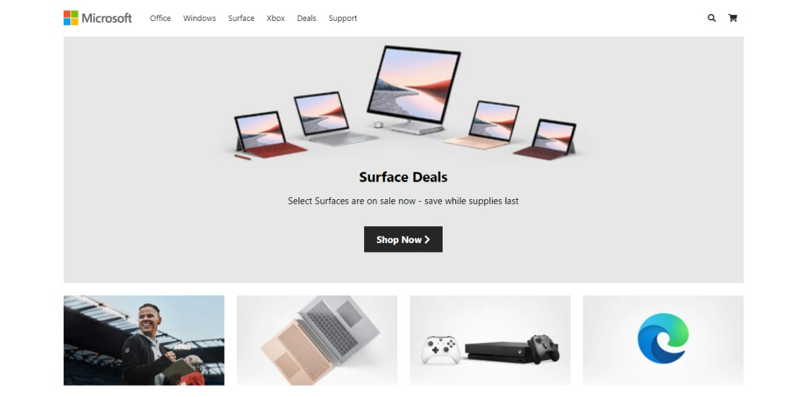

# Clone da Página Inicial da Microsoft em HTML, CSS e JS

  <h2>Sobre o Projeto</h2>
  
O objetivo deste projeto é praticar e aprimorar minhas habilidades em desenvolvimento web, usando tecnologias fundamentais como HTML, CSS e JavaScript. Neste repositório você encontrará os arquivos necessários para replicar a página inicial da Microsoft, incluindo o HTML estrutural, os estilos CSS e as interações em JavaScript.

   

  <h2>Funcionalidades Implementadas</h2>
  <ul>
    <li>Layout responsivo para diferentes tamanhos de tela, garantindo uma experiência consistente em dispositivos móveis e desktops.</li>
    <li>Interação com elementos da página, como botões, menus e imagens.</li>
    <li>Utilização de técnicas modernas de design e animações para tornar o clone visualmente atraente.</li>
  </ul>

  <h2>Instruções de Uso</h2>
  <ol>
    <li><a href="https://joaolucassousa.github.io/Microsoft-Homepage-clone/">👆 Clique aqui</a> para visualizar a página via GitHub Pages.</li>
    <h3>Ou</h3>
    <li>Faça o clone deste repositório em sua máquina local.</li>
    <li>Abra o arquivo <code>index.html</code> em seu navegador preferido.</li>
    <li>Explore a página inicial da Microsoft e interaja com os elementos presentes.</li>
    <li>Experimente redimensionar a janela do navegador para ver o layout responsivo em ação.</li>
  </ol>

  <h2>Contribuição</h2>
  
Contribuições são bem-vindas! Sinta-se à vontade para fazer fork deste repositório, adicionar novos recursos, corrigir bugs ou melhorar o código existente. Por favor, envie suas alterações através de pull requests.

  <h2>Licença</h2>
  
Este projeto está licenciado sob a <a href="LICENSE">Licença MIT</a>, o que significa que você pode usá-lo, modificá-lo e distribuí-lo livremente, desde que mantenha a atribuição dos direitos autorais.

  
Espero que este projeto seja útil para a sua prática de desenvolvimento web e inspire novas ideias. Divirta-se e fique à vontade para entrar em contato caso tenha alguma dúvida ou sugestão. 😊

